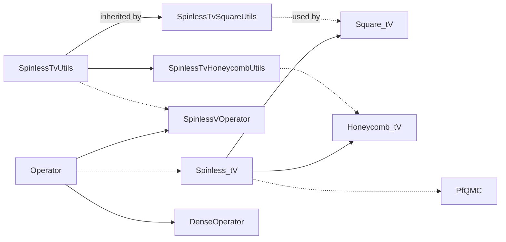

# Pfaffian Quantum Monte Carlo (PfQMC)

A prototype implementation of the Pfaffian Quantum Monte Carlo (PfQMC) algorithm for simulating fermionic quantum many-body systems. This repository implements the spinless t-V model with possible p+ip pairing term, and the interacting Kitaev chain.

Check on our paper [arXiv:2408.10311](https://arxiv.org/abs/2408.10311) for a complete description of the algorithm and related derivations.

## Usage


The repo relies on the [PFAPACK](https://arxiv.org/abs/1102.3440) for Pfaffian-related calculations, included in `inc/pfapack`. [Eigen](https://eigen.tuxfamily.org/) library, along with the Intel® oneAPI Math Kernel Library ([oneMKL](https://www.intel.com/content/www/us/en/developer/tools/oneapi/onemkl.html)) is used for matrix operations.

To build with CMAKE,
```bash
# build PFAPACK first with your favorite fortran compiler (ifx here)
cd inc/pfapack/fortran && make mFC=ifx && cd ../c_interface && make

# run setvars.sh in the Intel oneAPI directory,
# mkl dependencies should be automatically located
mkdir build && cd build
cmake .. -DEIGEN3_INCLUDE_DIR=/path/to/eigen3 & make
```

See `.github/workflows/main.yml` for a complete build and test workflow.

## Program Design



## Reproducible HPC workflow

Core PfQMC sources are in inc/ and src/; main.cpp and Makefile build the legacy executable. The zero-temperature driven Kitaev implementation is in reproduction/driven_kitaev/. Its entry point is driven_driver.cpp; exact ED reference is exact_driven_reference.py; static_contour_compare.cpp and driven_fastupdate_check.cpp are the small validation programs.

Use the validated Intel oneAPI/MKL/Eigen environment on HPC. For the current toolchain, initialize oneAPI, set EIGEN3_INCLUDE_DIR to the Eigen include root, and use the mpiicpc compiler. Boost multiprecision headers, when needed by diagnostics, are available at /home/sunxr/boost_1_70_0. Example:

  source /opt/ohpc/pub/apps/intel/oneapi/setvars.sh
  export EIGEN3_INCLUDE_DIR=/home/sunxr/software/eigen-3.4.0
  CXX=mpiicpc MKLFLAG=-mkl reproduction/driven_kitaev/build.sh

A minimal driven smoke command is:

  reproduction/driven_kitaev/driven_driver 4 0 4 2 2 2 0.1 1 0 10 30 4242

The JSON output records contour metadata, S_pi, S_pi_dq, R_cdw, average_sign, acceptance, runtime, imaginary-part diagnostics, sign corrections, guard/rebuild counters, minimum update denominator, and multiprecision fallback counters.

Historical outputs are indexed in reproduction/driven_kitaev/results/FINAL_RESULTS_INDEX.md and preserved outside this repository in PfQMC-main_archived_results_20260821/.
